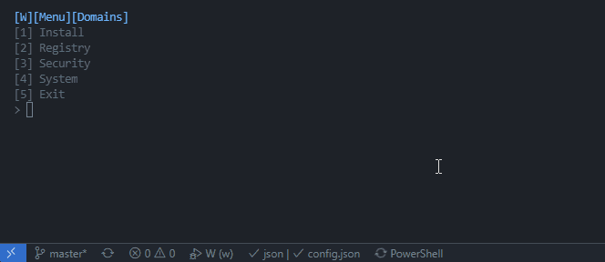

# w

windows dev system management script 

# features

* Extensible powershell script for onboarding & management 
* Manages Winget, Chocolately, & Vckpkg 
* System clean with automated windows commands and 3rd party software
* Run as script or global powershell module 
* Quick Menu For Commands 
	* Install
	* Registry
	* System
* Easily add new domains or functions to framework

# How to use 

* Run the standalone entry script 
` cd src/
` .\w.ps1 

* Import module to session
` cd src/
` Import-Module .\w.psm1 
` Start-W || w (alias)
` w -c Update-System (autocompletion with c flag)

* Install module globally
` cd src/
` Install-Module .\w.psm1 
` Start-W || w (alias)
` w -c Update-System (autocompletion with c flag)

# Configuration 
Modify the config.json file for install Winget, Chocolately, Vcpkg, Windows Features, 
Visual Studio Code extensions, Visual Studio workloads, and more to come.

# Extending 
Adding a new domain or method is easy. 

* To add a domain :
Add the name of the domain in the domains section of config.json second to last. 
Then make the name a ps1 file in the modules folder with the corresponding name. 

* To add a function : 
Add a function to an existing domain ps1 file. 
Make sure you use the Param() style for parameters.
Framework dynamically lists all functions by pulling from each domain file.

# Roadmap

* Quick Onboarding command combining exiting functions
* Remote Management
    * Reverse shells for running w commands
* Some other stuff i guess